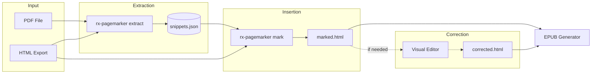

# RX Page Marker - Project Context

## Project Purpose
A Python tool that inserts page number markers into HTML files for EPUB3 generation. Part of the RX EPUB generation pipeline, converting InDesign HTML exports into EPUB3 files with accurate page-list navigation.

## Page Marker HTML Format
The tool inserts standardized page markers:
```html
<span id="page5" class="page-number" role="note" aria-label="Page 5">5</span>
```

| Attribute | Purpose |
|-----------|---------|
| `id="page5"` | Unique ID for EPUB page-list navigation (`<a href="chapter.xhtml#page5">`) |
| `class="page-number"` | CSS styling hook |
| `role="note"` | ARIA landmark - screen readers announce as supplementary info |
| `aria-label="Page 5"` | Full description for accessibility |

**Two-column layouts**: When the same page number appears twice (different articles), IDs are suffixed:
```html
<span id="page36" ...>36</span>    <!-- First occurrence -->
<span id="page36-2" ...>36</span>  <!-- Second occurrence -->
```

These markers enable EPUB page-list navigation, citation compatibility with print editions, and accessibility.

## Project Evolution

### Phase 1: Basic HTML Marking (Early version)
- Manual JSON creation with text snippets
- Simple text matching in HTML
- Required snippets within single text nodes

### Phase 2: Intelligent Snippet Matching (CHANGELOG: 2025-01-22)
- **DOM-aware insertion**: Snippets now match across formatting tags (`<i>`, `<b>`, `<span>`)
- **Template generator**: Automated JSON file creation with placeholders
- Users can copy directly from PDFs without worrying about HTML structure
- 100% success rate on test cases with complex formatting

### Phase 3: Professional Package Structure (commit: 542bf5e)
- Migrated to `src/` layout with type hints throughout
- Click-based CLI (`rx-pagemarker` command)
- Comprehensive pytest test suite (22 tests)
- Modern `pyproject.toml` packaging
- Development tools: black, mypy, flake8

### Phase 4: Advanced PDF Extraction (commit: 9c8eefb)
- **Automated PDF extraction**: PyMuPDF & pdfplumber backends
- **Word segmentation**: Handles PDFs with missing spaces (dictionary-based)
- **HTML matching**: Matches PDF snippets against clean HTML for perfect word boundaries
- **Confidence scoring**: Review mode identifies low-quality extractions
- Greek language support with extensible framework
- Two extraction strategies: `end_of_page` (fast) and `bottom_visual` (layout-aware)

### Phase 5: Production PDF Support (commit: f13700d)
- **InDesign metadata filtering**: Auto-excludes sluglines (`file.indd 123`) and timestamps
- **Dehyphenation**: Rejoins words split across lines for better HTML matching
- **Text normalization**: Handles spacing around punctuation and slashes
- **Improved validation**: Strips HTML tags before comparing, normalizes whitespace
- **CLI options**: `--exclude-pattern` for custom patterns, `--no-default-excludes`
- Tested on 272-page two-column legal magazine: 78.6% content match rate

### Phase 6: Magazine Support & Smart Correction
- **Page offset**: `--page-offset N` for magazines with continuing page numbers
- **Footnote filtering**: Skipped by default (`--include-footnotes` to include)
- **Partial word completion**: Completes cut-off words using HTML
  - "σύγ" at end of snippet becomes "σύγχυση" if found in HTML
  - Page marker placed AFTER the complete word
- **Context-based correction**: Fixes merged words in middle of snippets
  - Finds anchor sequences of 2-3 correctly-extracted words in HTML
  - Extracts correct surrounding context to replace corrupted snippet
  - Improved match rate from 71.8% to 98.9% on test magazine
- **CSS injection**: `--inject-css` flag on `mark` command for visible page markers in browser
- Unicode-aware word boundary detection for Greek and other scripts

### Phase 7: CLI Simplification (2025-01-13)
- **HTML now default**: HTML file is a required positional argument (enables word completion by default)
- **New CLI syntax**: `rx-pagemarker extract book.pdf snippets.json book.html`
- **`--raw-pdf` flag**: Opt-out of HTML correction for faster but less accurate extraction
- **`--fuzzy-match` flag**: Replaces `--match-html` for slow fuzzy matching on corrupted PDFs
- **Better error messages**: Clear guidance when HTML file is missing

### Phase 8: Sequential Position Tracking (2025-01-14)
- **Problem**: Markers placed out-of-order when snippet text appears multiple times in document
  - Example: Page 900's snippet "του δικαστηρίου" also exists on page 200
  - Old approach: First occurrence wins → wrong placement
- **Solution**: Track insertion position sequentially
  - Process pages in ascending order
  - Track both container index AND position within container
  - Each new marker must come AFTER previous marker's position
  - Handles multiple page breaks within same paragraph
- **Frontmatter/backmatter filtering**: Use `--start-page` and `--end-page` to exclude non-body content
  - Critical for magazines where PDF frontmatter (TOC, etc.) isn't in HTML export
- **Results on test magazine (XRDD 4/2025)**:
  - Before: 47 markers (18% - 204 out-of-order removed)
  - After filtering + position tracking: **228/232 markers (98.3%)**
- **Remaining issues**: 4 pages with PDF extraction problems (791, 825, 862, 897)

### Phase 9: Page Offset Hack for EPUB Navigation (2025-01-15)
- **Problem**: EPUB readers expect page markers to indicate where a page BEGINS
  - `end_of_page` strategy extracts last words of page N → marker placed after them
  - Semantically this marks "end of page N" not "beginning of page N+1"
  - A `beginning_of_page` strategy was attempted but had lower success rate (72.7%)
    - Page beginnings have more repeated content (section headers, common phrases)
    - Sequential tracking rejects more duplicates
- **Solution**: The "Offset Hack"
  - Use `end_of_page` strategy (98% success rate due to unique text)
  - Add +1 to page offset so marker at END of page N is labeled as page N+1
  - Result: Marker says "776" right where page 776 content begins
  - Semantically correct for EPUB while keeping high extraction success
- **Implementation**:
  - Markers always placed AFTER snippet text (simplified, removed `--position-after` flag)
  - User applies +1 to `--page-offset` value
  - Example: PDF page 7 = magazine page 775, use `--page-offset 769` (not 768)
- **Results on XRDD 4/2025**:
  - 226/231 markers (97.8%) with correct EPUB semantics
  - Only 5 pages need manual attention

### Phase 10: Context Matching for Duplicate Disambiguation (2025-01-17)
- **Problem**: Sequential tracking rejects snippets that appear earlier, but can't distinguish between multiple valid positions
  - Example: "του δικαστηρίου" appears on pages 200, 500, and 900
  - Sequential tracking finds page 200's occurrence for page 900's snippet
  - No way to select the correct occurrence when context differs
- **Solution**: Capture and use context during matching
  - Extract N words before/after snippet during PDF extraction
  - Store in JSON: `context_before` and `context_after` fields
  - During HTML matching, score all occurrences using Jaccard word similarity
  - Select best match if score ≥ 0.3, otherwise fall back to first sequential match
- **Implementation**:
  - `--context-words N` flag (default: 4, 0 to disable)
  - Greek accent normalization for robust matching
  - Weighted scoring: 40% before-context, 60% after-context (after is more reliable for `end_of_page`)
- **JSON format change**:
  ```json
  {
    "page": 900,
    "snippet": "του δικαστηρίου",
    "context_before": "η απόφαση",
    "context_after": "είναι τελεσίδικη"
  }
  ```
- **Statistics**: Validation and extraction now report context coverage

### Phase 11: Visual Marker Editor (2025-01-17)
- **Purpose**: Browser-based tool for non-technical users to correct marker positions
- **Location**: `tools/page-marker-editor.html`
- **Features**:
  - Single HTML file - no server, no dependencies, works offline
  - Load any marked HTML file via file picker
  - Page markers appear as red draggable badges
  - Drag markers to correct positions between words
  - **Add new markers**: Click "+ Add Marker", then click any word to insert marker after it
    - Word-boundary only insertion (prevents breaking words)
    - Suggests next sequential page number
    - Press Escape to exit add mode
  - **Edit/delete markers**: Double-click any marker to change its number or delete it
    - Enter new number to update
    - Leave empty and confirm to delete
  - Visual drop indicator shows insertion point
  - Undo/Redo support (Ctrl+Z / Ctrl+Y)
  - Zoom controls for detailed positioning
  - Download corrected HTML preserving original document structure
  - **Copy Body Content**: Copy inner body HTML to clipboard (no `<html>`/`<head>`/`<body>` wrapper) for pasting into other documents
    - Useful for re-editing a single article: paste article HTML into a file, edit markers, copy back
    - Clipboard API guard for `file://` protocol — falls back to Download if unavailable
  - Toast notifications for user feedback
  - **Auto-save to localStorage**: Your work is automatically saved after every change
    - Notifies user after 3 consecutive save failures (localStorage full/disabled)
    - Prompts manual download if auto-save unavailable
  - **Timestamped downloads**: Files are named `corrected_YYYY-MM-DD_HH-MM.html`
  - **Export validation**: Skips corrupted markers without page numbers, notifies user of count
- **Usage**:
  1. Open `tools/page-marker-editor.html` in any browser
  2. Click "Load HTML File" and select your marked HTML
  3. Drag red markers to correct positions
  4. To add missing markers: click "+ Add Marker", click a word, enter page number
  5. Click "Download Corrected HTML" or "Copy Body Content" to clipboard
  6. To re-edit a single article: copy its HTML into a file, load in editor, edit markers, use "Copy Body Content" to paste back
  7. To continue editing later: reload any downloaded file
- **Auto-save & Recovery**:
  - Work is saved to browser's localStorage after every change
  - On refresh or tab close, your work is preserved
  - When reopening the editor, you'll be prompted: "Found unsaved work from X minutes ago. Do you want to restore it?"
  - Click OK to restore and continue editing (no need to reload the file)
  - Click Cancel to start fresh
  - **What could cause data loss**:
    - Clearing browser data/cache
    - Saved data older than 7 days (auto-cleared)
    - Using incognito/private browsing mode
    - Clicking "Cancel" on the restore prompt
- **Sample file**: `examples/sample_with_markers.html` for testing
- **Known limitation**: The download uses XMLSerializer which reformats HTML:
  - Adds `<!DOCTYPE html>` declaration
  - Collapses whitespace and indentation
  - May reorder attributes (e.g., `class` before `id`)
  - Content and structure remain identical, only formatting changes
  - Safe for EPUB generation; not suitable if exact byte-for-byte preservation is needed

## Current Status (as of 2025-01-21)

### Production Ready
- ✅ Full CLI tool with professional packaging
- ✅ Automated PDF extraction with multiple backends
- ✅ Advanced text reconstruction for broken PDFs
- ✅ Expanded Greek dictionary (~10k most frequent words from Hermit Dave's lists)
- ✅ Comprehensive validation and reporting
- ✅ Strong test coverage (79 tests)
- ✅ **Production metadata filtering** - Auto-removes InDesign sluglines and timestamps
- ✅ **Magazine PDF support** - Tested with 272-page legal magazine (98.3% marker insertion rate)
- ✅ **Dehyphenation** - Rejoins words split across lines
- ✅ **Improved validation** - Strips HTML tags before comparing snippets
- ✅ **Page offset support** - For magazines with continuing page numbers (`--page-offset`)
- ✅ **Footnote filtering** - Skip small font text with `--skip-footnotes`
- ✅ **Partial word completion** - Completes cut-off words using HTML (`--complete-words`)
- ✅ **Context-based correction** - Fixes merged words using anchor sequences from HTML
- ✅ **CSS injection** - `--inject-css` for visible page markers in browser
- ✅ **Sequential position tracking** - Handles duplicate snippets and multiple page breaks per paragraph
- ✅ **Context matching** - Disambiguates duplicate snippets using surrounding words (`--context-words`)
- ✅ **Visual marker editor** - Browser-based drag-and-drop tool for correcting marker positions

### Known Issues
- **Fuzzy HTML matching performance**: Slow for large documents (several minutes for 50k+ word HTML files) - only affects `--fuzzy-match` flag, not the default workflow
- **Morphological coverage**: Some rare Greek word forms not in top-10k frequency list
- **PDF extraction edge cases**: ~1.7% of pages may have extraction issues requiring manual snippets

### Best Practices
- **Markers in titles/headings**: If a page marker lands at the beginning of a title or heading, use the visual editor to move it to the start of the first body paragraph instead. This ensures cleaner EPUB rendering and avoids disrupting heading styles.

## Architecture

### Pipeline Overview



**Workflow:**
1. **Extract**: Pull page-ending snippets from PDF, with context for disambiguation
2. **Mark**: Insert page markers into HTML at snippet locations
3. **Correct** *(optional)*: Use visual editor to fix any misplaced markers
4. **Generate**: Feed marked HTML to EPUB generator for page-list navigation

### Core Modules (`src/rx_pagemarker/`)
- `cli.py` - Click-based command-line interface
- `marker.py` - Page marker insertion logic (DOM-aware snippet matching)
- `template.py` - JSON template generation
- `pdf_extractor.py` - PDF text extraction with multiple backends
- `word_segmentation.py` - Dictionary-based word boundary reconstruction
- `html_matcher.py` - HTML-based word boundary correction

### Workflows

#### Workflow 1: Automated (Recommended)
```bash
# Extract snippets from PDF with HTML correction (default, recommended)
# HTML file is required for word completion and context correction
rx-pagemarker extract book.pdf snippets.json book.html

# For magazines with page offset - USE THE OFFSET HACK!
# PDF page 7 = print page 775, but use offset 769 (775-7+1) for correct EPUB semantics
# The +1 ensures markers indicate where pages BEGIN, not where they END
rx-pagemarker extract magazine.pdf snippets.json mag.html \
  --start-page 7 --end-page 237 --page-offset 769

# Raw PDF extraction without HTML (faster but less accurate)
rx-pagemarker extract book.pdf snippets.json --raw-pdf

# For heavily corrupted PDFs, use fuzzy matching (slow)
rx-pagemarker extract book.pdf snippets.json book.html --fuzzy-match

# Validate snippets
rx-pagemarker validate snippets.json --html book.html

# Insert markers (invisible markers by default for EPUB)
rx-pagemarker mark book.html snippets.json output.html

# Or with visible markers for previewing in browser
rx-pagemarker mark book.html snippets.json output.html --inject-css
```

#### Workflow 2: Manual
```bash
# Generate template
rx-pagemarker generate 200 pages.json

# Manually fill in snippets
# (edit pages.json)

# Insert markers
rx-pagemarker mark book.html pages.json output.html
```

#### Two-Column Layouts (Multiple Articles per Page)

For magazines/journals where different articles share the same page (e.g., left column = Article A, right column = Article B), both articles need separate page markers with the same page number.

**The tool supports duplicate page numbers.** Add multiple entries with the same page but different snippets:

```json
[
  {"page": 35, "snippet": "end of previous content"},
  {"page": 36, "snippet": "Εισαγωγή στην έννοια της αδικοπραξίας"},
  {"page": 36, "snippet": "Η νομολογία του Αρείου Πάγου"},
  {"page": 37, "snippet": "..."}
]
```

**Requirements:**
- Snippets must be different (they will be - different articles)
- Snippets must appear in HTML in the same order as the JSON
- After extraction, manually duplicate entries for two-column pages

**Workflow:**
1. Run `rx-pagemarker extract` normally (extracts one snippet per PDF page)
2. Identify pages where multiple articles start
3. Manually add entries for the second column's article start
4. Run `rx-pagemarker mark` - both markers will be inserted
5. When HTML is split into article files later, each article keeps its page marker

## Roadmap & Next Steps

### High Priority
1. ~~**Visual marker editor**~~ ✅ **Completed in Phase 11** - `tools/page-marker-editor.html`

2. **Unified Local Workflow with rx-magazine-validator**

   **Goal**: Single command to validate HTML → extract page markers → insert markers

   **Why**: Currently requires switching between web UI (validator) and CLI (pagemarker). Unified workflow reduces friction and ensures validation before marking.

   **Architecture** (two separate repos, one workflow):
   ```
   rx-magazine-validator/     # Validation rules (Schematron + Python)
   rx-pagemarker/             # Page marker extraction & insertion
           ↓
   Unified CLI script or local web app
           ↓
   Validate → Extract → Mark → Output
   ```

   **Implementation Options**:

   | Option | Description | Effort |
   |--------|-------------|--------|
   | **CLI wrapper script** | Python script importing both tools, runs locally | Low |
   | **Local web app** | Add pagemarker to validator's FastAPI, single localhost server | Medium |
   | **Shared library** | Extract common code, both tools import it | High |

   **Recommended: CLI wrapper script** (`tools/workflow.py`)
   ```bash
   # Usage
   python tools/workflow.py magazine.html magazine.pdf --page-offset 769

   # What it does:
   # 1. Validates HTML structure (calls rx-magazine-validator)
   # 2. If errors → stops and reports
   # 3. If valid → extracts snippets from PDF
   # 4. Inserts page markers into HTML
   # 5. Outputs marked HTML file
   ```

   **Workflow Diagram**:
   ```
   ┌─────────────┐     ┌─────────────┐     ┌─────────────┐
   │  HTML file  │     │  PDF file   │     │  Config     │
   │  (InDesign) │     │  (source)   │     │  (offset)   │
   └──────┬──────┘     └──────┬──────┘     └──────┬──────┘
          │                   │                   │
          ▼                   │                   │
   ┌─────────────────────┐    │                   │
   │  rx-magazine-       │    │                   │
   │  validator          │    │                   │
   │  (structure check)  │    │                   │
   └──────────┬──────────┘    │                   │
              │               │                   │
         valid? ──No──► STOP with errors         │
              │                                   │
              │Yes                                │
              ▼                                   │
   ┌─────────────────────────────────────────────┤
   │  rx-pagemarker extract                      │
   │  (PDF → snippets.json)                      │
   └──────────┬──────────────────────────────────┘
              │
              ▼
   ┌─────────────────────┐
   │  rx-pagemarker mark │
   │  (HTML + snippets   │
   │   → marked HTML)    │
   └──────────┬──────────┘
              │
              ▼
   ┌─────────────────────┐
   │  Output:            │
   │  - marked.html      │
   │  - snippets.json    │
   │  - validation.log   │
   └─────────────────────┘
   ```

   **Prerequisites**:
   - Both repos cloned locally
   - Single virtualenv with both installed:
     ```bash
     pip install -e /path/to/rx-magazine-validator
     pip install -e "/path/to/rx-pagemarker[pdf]"
     ```

   **Future Enhancement**: Add `/validate-and-mark` endpoint to validator's FastAPI for web-based unified workflow (optional - CLI may be sufficient).

### Medium Priority
3. **Multi-language support** - Add frequency dictionaries for other languages (English, French, etc.)
4. **Enhanced morphological coverage** - Add morphological rules or expanded word forms for Greek
5. ~~**Context matching** - Disambiguate duplicate snippets using surrounding text~~ ✅ **Completed in Phase 10**
6. **Smart snippet refinement** - Auto-adjust snippets that appear multiple times
7. **Multi-column extraction** - Extract multiple snippets from same page for two-column layouts
   - **Use case**: Magazine pages where left and right columns contain different articles
   - Both articles start on same page number and need separate markers
   - After HTML is split into individual article files, each keeps its page marker
   - **Open questions**:
     - Flag design: `--2col` for all pages vs `--2col-pages 36,42,78` for specific pages?
     - Column detection: Split at 50% width, or use pdfplumber layout analysis?
     - Page numbering: Same number for both (`36`, `36`) or labeled (`36a`, `36b`)?
   - **Current workaround**: Manually duplicate JSON entries with different snippets:
     ```json
     {"page": 36, "snippet": "start of left column article"},
     {"page": 36, "snippet": "start of right column article"}
     ```

### Low Priority
8. **Optimize HTML fuzzy matching algorithm** - Only used with `--fuzzy-match` flag (rare)
   - **Why low priority**: Default workflow uses fast word completion (~100ms/snippet) and context correction (~50ms/snippet), achieving 97%+ success rate. Fuzzy matching is only needed for heavily corrupted PDFs where word boundaries are completely broken.
   - **Current complexity**: O(W × N × L) where W=window sizes tried, N=positions, L=window length
     - Outer loop: iterates through window sizes (from snippet_len/20 to total_words)
     - Inner loop: iterates through all starting positions
     - Each iteration: computes fuzzy similarity O(L)
     - Approaches O(N²) for large documents since W approaches N
   - **Potential optimizations** (if ever needed):
     - N-gram indexing with locality-sensitive hashing → O(N) build, O(1) lookup
     - Rabin-Karp rolling hash → O(N) per query
     - Better pruning heuristics and early termination
     - Parallel processing across snippets

### Future Enhancements
9. **Interactive preview mode** - Preview matches before insertion
10. **Batch processing** - Process multiple HTML files at once
11. **OCR support** - Handle image-based PDFs with Tesseract
12. **Neural word segmentation** - ML model for language-agnostic segmentation

## Technical Decisions

### Why PyMuPDF over pdfplumber?
- **Performance**: 10x faster for large files (500+ pages)
- **Memory**: Lower memory footprint
- **Use pdfplumber when**: Complex layouts with tables/columns

### Why dictionary-based segmentation?
- **Zero dependencies**: No external services or large ML models
- **Fast**: Real-time processing even for large PDFs
- **Extensible**: Easy to add new languages by adding word lists

### Why HTML matching for broken PDFs?
- **Accuracy**: Perfect word boundaries when HTML source is available
- **Trade-off**: Slower than segmentation but higher quality
- **Use case**: Best for InDesign exports where you have both PDF and clean HTML

### Fast vs Slow HTML Correction

The tool has three HTML correction approaches (N = HTML document size in words):

| Approach | Flag | Complexity | Speed | Use Case |
|----------|------|------------|-------|----------|
| **Word completion** | (default) | O(N) linear | ~100ms/snippet | Default - completes partial words at snippet boundaries |
| **Context correction** | (default) | O(N) linear | ~50ms/snippet | Default - fixes merged words using anchor sequences |
| **Fuzzy matching** | `--fuzzy-match` | O(N²) quadratic | seconds/snippet | Rare - heavily corrupted PDFs only |

**Default workflow (97%+ success rate):**
- Word completion finds partial words and completes them from HTML
- Context correction locates anchor sequences and extracts correct surrounding text
- Both are fast O(N) algorithms suitable for any document size

**Fuzzy matching (rarely needed):**
- Slides a window across entire HTML, computing fuzzy similarity at each position
- Required only when PDF has completely broken word boundaries
- Known to be slow but rarely used in practice

### The Offset Hack: Why +1 to page offset?
EPUB page navigation expects markers to indicate where a page **begins**. We solve this with a minor offset adjustment:

**The Problem:**
- `end_of_page` strategy extracts last words of page N
- Marker placed after those words marks "end of page N"
- But EPUB readers expect "Page 776" to jump to where page 776 **starts**

**Why not use `beginning_of_page`?**
- Page beginnings have more repeated content (headers, section titles)
- Only 72.7% success rate vs 97.8% for `end_of_page`
- Sequential position tracking rejects more duplicates

**The Solution:**
- Use `end_of_page` (high success rate)
- Add +1 to page offset
- Marker at END of page 775 gets labeled "776"
- Reader clicking "Page 776" lands right where page 776 content begins

**Formula:**
```
offset = first_magazine_page - first_pdf_page + 1
       = 775 - 7 + 1 = 769
```

**Visual:**
```
...end of page 775 content[776]beginning of page 776 content...
                          ↑
           Marker labeled 776 placed at page break
```

### Single-Column vs Two-Column Layouts

The tool handles different PDF layouts with different strategies:

**Single-Column PDFs (default `end_of_page` strategy):**
```
┌─────────────────────┐
│                     │
│     Body Text       │
│                     │
│     [extract here]◄─│  ← Last words of body
├─────────────────────┤
│     Footnotes       │  ← Filtered by font size
└─────────────────────┘
```
- **Success rate**: 97.8% (tested on XRDD magazine)
- **How it works**: Extracts last N words from page, footnotes filtered by font size
- **Why it works**: Page endings have unique text, footnotes clearly separated

**Two-Column PDFs (use `--two-column` flag):**
```
┌───────────┬───────────┐
│           │           │
│   Left    │   Right   │
│  Column   │  Column   │
│           │           │
│           │ [extract]◄│  ← End of RIGHT column body
├───────────┴───────────┤
│      Footnotes        │  ← Skip this zone entirely
└───────────────────────┘
```
- **Problem with default**: `end_of_page` extracts from footnote zone (wrong area)
- **Solution**: Column-aware extraction that:
  1. Detects footnote zone by y-position (bottom ~25% of page)
  2. Extracts only from body text area
  3. Takes text from end of rightmost column

**Why not use `beginning_of_page` for two-column?**
- Headers/section titles repeat across pages
- Only 72.7% success rate in testing
- Sequential position tracking rejects too many duplicates

**Choosing the right approach:**
| PDF Type | Flag | Strategy |
|----------|------|----------|
| Single-column | (default) | `end_of_page` with footnote filtering |
| Two-column magazine | `--min-font-size 9.0` | Standard extraction + visual editor (see note below) |
| Complex tables | Manual | Use visual editor |

> **⚠️ NOTE:** Do NOT use `--two-column` flag - it has column sorting bugs that create garbled text. Use standard extraction with `--min-font-size` filtering instead, expect ~50-60% automated success, and use the visual editor for the rest.

## Project Structure

### Directory Organization

**`tests/`** - Automated Test Suite
- Python unit and integration tests (`test_*.py`)
- Run with `pytest`
- Verifies code correctness
- Part of CI/CD pipeline

**`examples/`** - User Examples and Samples
- Sample HTML/JSON files for documentation
- Demonstrates tool usage for end users
- Manual testing and quick starts
- Referenced in README and guides

**`src/rx_pagemarker/`** - Source Code
- Main package code
- `data/` subdirectory contains dictionary files

**Root test artifacts** (`.gitignored`)
- `test_*.json`, `test_*.html` - Temporary test outputs
- `chapter*.json` - Test data from real PDFs
- Not tracked in git

## Development Commands

```bash
# Install with all features
pip install -e ".[pdf,dev]"

# Run automated tests
pytest

# Try tool with examples
rx-pagemarker mark examples/sample_book.html examples/page_references_example.json output.html

# Format code
black src/ tests/

# Type check
mypy src/

# Lint
flake8 src/ tests/
```

## Production Use Cases

### XRDD Magazine (Χρονικά Δικονομικού Δικαίου)
Legal magazine successfully processed with 97.8% marker insertion rate using the offset hack.

**Magazine structure:**
- 272-page PDF with continuing page numbers from previous issues
- Pages 1-6: Frontmatter (TOC, etc.) - not in HTML export
- Pages 7-238: Body content (232 pages) → Magazine pages 775-1006
- Pages 239-272: Backmatter - not in HTML export

**Extraction command (with offset hack):**
```bash
# Note: --page-offset 769 (not 768) for correct EPUB semantics
# Formula: 775 - 7 + 1 = 769
rx-pagemarker extract "XRDD_4_2025.pdf" snippets.json "XRDD_body.html" \
  --start-page 7 --end-page 237 --page-offset 769
```

**Key flags for magazine workflow:**
| Flag | Value | Purpose |
|------|-------|---------|
| `--start-page` | 7 | Skip frontmatter not in HTML |
| `--end-page` | 237 | Skip backmatter (end-1 because we label next page) |
| `--page-offset` | 769 | Offset hack: 775-7+1 for correct EPUB semantics |

**Results:** 226/231 markers (97.8%), 5 pages needed manual snippets.

## Related Projects
- **rx-ind-epub-gen**: EPUB3 generator from InDesign HTML exports
- Uses same quality standards and conventions

## Session Notes (2025-01-15) - XRDD 4/2025 Magazine

### Test Files
- **PDF**: `sample-files/XRDD 4:2025 FINAL.pdf` (272 pages total)
- **HTML**: `sample-files/XRDDD4 2025ENOMENO-fixed-class.html`
- **Output**: `sample-files/XRDDD4_end_offset.html` (with offset hack)
- **Snippets**: Generated with offset hack for correct EPUB semantics

### PDF Structure
- Pages 1-6: Frontmatter (excluded)
- Pages 7-238: Body content (232 pages) → Magazine pages 775-1006
- Pages 239-272: Backmatter (excluded)
- Page offset: **769** (with +1 offset hack for EPUB semantics)

### Extraction Command (with Offset Hack)
```bash
rx-pagemarker extract "sample-files/XRDD 4:2025 FINAL.pdf" snippets.json \
  "sample-files/XRDDD4 2025ENOMENO-fixed-class.html" \
  --start-page 7 --end-page 237 --page-offset 769
```

### Results
- 226/231 markers inserted (97.8%)
- 5 pages with issues: **792, 826, 863, 884, 898**

### Key Learnings
1. **Offset Hack**: Using `end_of_page` + offset+1 gives correct EPUB semantics with high success rate
2. **Beginning of page strategy**: Attempted but only 72.7% success due to repeated headers/section titles
3. **Trade-off**: Sacrificed 2 markers (231 vs 232) for correct page navigation semantics

## Session Notes (2025-01-19) - XRID December 2025 Magazine (Two-Column)

### Test Files
- **PDF**: `sample-files/2025-12-xrid/XRID DECEMB 2025 FINAL.pdf` (88 pages total)
- **HTML**: `sample-files/2025-12-xrid/xridDECEMB2025enomeno-aris-fn-check.html`
- **Output**: `sample-files/2025-12-xrid/XRID_December_marked.html`
- **Snippets**: `sample-files/2025-12-xrid/snippets_manual_fixed.json`

### PDF Structure
- Pages 1-4: Frontmatter (excluded)
- Pages 5-56: Body content (52 pages) → Magazine pages 722-773
- Pages 57+: Index/backmatter (excluded)
- Page offset: **717** (with +1 offset hack: 722 - 5 + 1 = 718, but we use 717 in extraction)

### Two-Column PDF Challenges Discovered

**Problem 1: `--two-column` flag has column sorting issues**
- Text at same y-coordinate gets sorted incorrectly
- Creates garbled snippets like "τα τακτικά , ελλείπει δικαστήρια" instead of proper reading order

**Problem 2: Standard extraction gets wrong column**
- Without `--two-column`, extracts from left column (which extends lower on page)
- Left column footnotes get included even with font filtering

**Problem 3: Word completion extends beyond page breaks**
- HTML word completion finds the complete word but extends INTO next page content
- Causes markers to be placed inside page content rather than at boundaries
- Solution: Use `--raw-pdf` or manually fix snippets

**Problem 4: Footnote numbers in HTML break matching**
- PDF: "διαιτησίας. Η διαιτησία"
- HTML: "διαιτησίας24. Η διαιτησία" (footnote "24" inserted)
- Solution: Strip footnotes from HTML for matching, or adjust snippets

**Problem 5: Hyphenated words at line ends**
- PDF has "αντισυμ-\nβαλλομένων" split across lines
- Dehyphenation may not fully reconstruct
- These snippets fail to match

### Recommended Workflow for Two-Column PDFs

```bash
# Step 1: Extract with footnote filtering (NOT --two-column)
rx-pagemarker extract "magazine.pdf" snippets.json "magazine.html" \
  --start-page 5 --end-page 55 --page-offset 717 \
  --min-font-size 9.0

# Step 2: Mark and check results
rx-pagemarker mark magazine.html snippets.json output.html --inject-css

# Step 3: Use visual editor for failed markers
# Open tools/page-marker-editor.html
```

**Key flags:**
| Flag | Purpose |
|------|---------|
| `--min-font-size 9.0` | Filter footnotes (adjust based on PDF - check footnote font size) |
| `--start-page` / `--end-page` | Exclude frontmatter/backmatter not in HTML |
| `--page-offset` | Offset hack formula: `first_mag_page - first_pdf_page + 1` |
| `--raw-pdf` | Disable word completion if it extends snippets beyond page breaks |

### Results
- **30/52 markers** (57.7%) inserted automatically
- **22 markers** needed manual positioning via visual editor
- Pages 722 and 723 correctly positioned as requested

### Why Not Use `--two-column` Flag?

> **⚠️ WARNING: Do NOT use `--two-column` - it has column sorting bugs that create garbled text.**

The `--two-column` flag was designed for column-aware extraction but has issues:
1. Column sorting within same y-coordinate is unreliable
2. Creates garbled text that doesn't match HTML
3. Standard extraction + `--min-font-size` filtering produces better results

### Practical Expectations for Two-Column PDFs
- **Expect 50-60% automated success rate** (vs 97%+ for single-column)
- Plan to use visual editor for remaining markers
- Main failure causes:
  - Hyphenated words at line ends
  - Footnote numbers in HTML
  - Column reading order issues
  - Page headers (e.g., "KE/2025") not in HTML